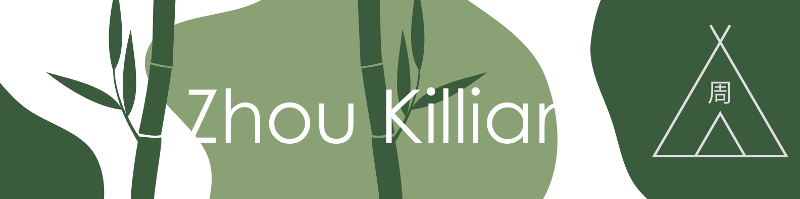

## Once was a panda in a bamboo forest
I'm what is commonly named an Aluropa Melanoleuca. Currently student in an engineering school of computer science, I'm first passionate of technologies. Even before my high school diploma (Baccalaureate S - SVT in france), I've study computer science and on-board systems.

However, I haven't discovered github at this time, then this repository collection let me introduce to you my projects done at EFREI Paris, my current college. At EFREI, I've been working on school project but not only. As an insider in computer science, I joined two associations which help me to develop my skills and make fun with those : ICE EFREI and SEPEFREI.

## The panda is an omnivorous being
As far I know, I never stay lock on one technology, which makes me kind of all-rounder. This can be highlighted by the project I share on this git :
### Medicinery
[![](https://img.shields.io/static/v1?message=Medicinery&logo=data%3Aimage%2Fpng%3Bbase64%2CiVBORw0KGgoAAAANSUhEUgAAAGQAAABkCAYAAABw4pVUAAAIYElEQVR42u2dA5QjSRjHe23veTJn361tnX3r3bMRnG3b9t3atm2MbdtMJv9733tT89KDTCap9KRq%2Bvfet67g%2B2193YXuVtwFQGsAYwDEQocRW52T1ooWAKCYCsCOxtCxV%2BeqlbdkPA130THyFOEHwAodT6EcGjyVYYYOb8zuypgHHW8xT5fhg1JEK1N6%2BQJggKSkZmbi1S%2B%2BwfDpc9B1wHAol12rirNGTsANDz%2BBnxcthdVmg4b4ORNihUQUl5Zi8v2PUMKbHB2uGYTnPv4cGmBtSIYRkpBfWAj%2FCddTYrnErY8btR2nAGgFSZh8%2F8OURO7R6vJ%2BWLJhM7yISshUCE5JaRnaXz2IkufVGHDHNHiJqQpD9LmpkKgYSpZm0anfEHgBu%2BOsrbAER0ZpKENdwux2OzjThoSMgaBk5%2BVRcpotuvQfxlvKWEXU9QxbVRUlpdnj9idM4EicAkEZN%2FcBnxBCcejUafBCSCEB4RGUCJ%2BKKk6lS9FLFZ%2F49t%2F5LVPIpPvYwM%2Fngg7wLUtIcnqGz8qgOBYc0rKE%2BLIMiu6DRrYcIRPVpUrasqXoA0C%2BQTPN0gtpe9UAYYQsWLteaiG0FiGMDIqxc%2B6XV0hRSYlQMijaXTVQXiEdrhksnBAKKYU88MqbvpJgXUhuQaGwMtpdLWHJ6jZwhLBCxs99UC4hL332lbAyKBZv2CSPkKzcXIFlsIFhkTxC%2Bg4b6yuJ1adOPvn1T%2BFl9Bk2Ro7JxZy8fE0T9873P2HF1u3cXzcwIlIOIX2Hj9NMxouffQnG3cZn9QWq2vy%2BdLnbCbjraUuT%2Fv3jb70HRhXnpeB5a9aJv4RbXFLqdgJoo8P2g4dd%2FvczLC%2FAka%2F%2Fmce%2Fd4guZNmmLU3%2B4n5jp8Bms4HoMmCYS22m3P8IatOKo4ygyCh5tgGVVVSgc7%2BhLn3xPUePg5GT79qJwLCpc8A4Mm8piAMnT%2FPfKCeykCqrDZYuBtbN6Wda2HH6xanmO%2FKgC5OPV998Jxg%2F3DST3ggE7ZLnX6oEFvJMt%2FNh6nAuBRYbX1Z9qV5DRqm%2B8Ls%2F%2FAyGtbyCCWw0UZdMuRmMP2c%2FhjcvHgwiPSuLm4wDJ0%2BBEFpI7KFjJEIV5s5%2BKMnNA2PBug3oeO0QFBYXg7Hh3c%2Bx4oW3QRwNDHKaqIsm3wTGoqdfovcAY8T0uVxkTLj3IRAiC6H%2F2WoZ6qDk1SkB5cUleKbbBaqktr6if4OJunDSjWCsee0DagdLF38QlVYrFxn0%2FoTwQl737%2B9UCIW503nIjksAcXLFupo%2Ff773JSCKihte1r1g4g1gbP74m5q2GVExID746VcuQrbsOyC%2BkMjd%2Byk5LscLfS9T%2Fb40vwDEHU%2Ba600SXeTJ2PXd76q26uOOZzF06iwQwgsxdzyPkuN2UEIbSup5YyeDceCP%2Bap227%2F6GcTxoBDPS9Xl%2FUAIL%2BTjIZM9krH10%2B9BHAsMrpOkM0eOB%2BPI%2FGV12rLTZR69Y%2FX2neILidx9wCMZFLbKynqT2mvIaOo1dY43LL6acDuI8ooKj2Vcdv2tIIQXYuls8EjGGxcOqnezNd0eg10kE7xhW71ty6pX784eNZHHAFB8Id9Oudvj3pEdmwBixIya8QM6Xju4phRF7jlYb7vne10MBqdSJbaQmANHPZZBAbtdldS2Vw6ouTlMwomABtulhUaAmPnMix7JoLKoJYqvliqKXd%2F%2FAWLL%2FgM114ZbrVYQGRExjZ6VERyuHRRfyK9330dJ4XYwp%2BvBKTlMRn5KmtN2RxeuALFq2w6PZKzbsRuE0EKSA0O4yPig31jVMYCVqdKCQpfGLATdAoPDmENYIWyuikukBoeBGDZtDp22stneRtv9%2B4ARREFRsSe9g%2Ba9xBdCyeAipON5YLAZ38qycpfaUg8izp94gyrBPQaNRAcX10H%2BXbUWhNBCMqNjufWOnd%2F%2BCkcqSkpcavf2pcPqXMtO0%2FgxiUlgPPzaW05ldO4%2FFM2Jwq1UsbkqDlFls6mm300dXWuXeCoQBC2r0hnZb0uXqz4jI7egAD0Gj3JyjaDgQgLWbOYm4%2FPRNzv0jFKYO%2Fm51I5WIRmPvfkuHDm%2BZBXo37x09pVs9E7QPRVVMj7%2F8x8QYgvheCCnCNu2mx0zaGHJ5XYH%2F16I2kTvP1Jvz93z098OmyUKQBv1egweCUJ4IZnRcVyFsHX2Z7tf0KQ2jtAC1yvnXu30379m6IfinFzVHUxlEEIHUs8EcIiFjz8PoqK0FF%2BOu7VJbTd99DV8CYX%2FuEP7qCwvx38Pmtxq%2B2Lfy%2BQRUl5U3NwyPJ0zo2kYeYRE7GLr5GLGEvOrIKQR8ufsR4WV8VzPi0BIJeSls64UVkhBRqZ0QoSV8cfMR%2BAb6ELYLkY5hbx45hXCCSnMypZXyB8zHxZKxrfXTQUhrZDw7XuEkUHjFUJmITRzKoyQvORUcECfOuERn424AYT0QojXDP19XgjRYoSkhUX6tIyMyGj5hYhStj4fdROIliSEXW7sk0JobV5%2BIYL0kvijJyEiCjiRdDrIZ2R8MmQKRIXrI4%2F%2Bvd%2BolyoOjzwaw3MraXNPyeenpkNgxnJ%2FbB5JMbNlVY0j4dhpCE4brz1Y8vnel2oqI%2FFkIATH7vVHr34%2B5havi3imqz%2FbYC060xyFUHiF4I3b2XZQ7vHVhDsgEa04Pb5b%2B7UTujK3KDsHEmFqtgfcr3n9Q9rx4d4C05SpKKPyJBdWpSEA%2BEEjaKxw4M%2F5%2BOm2uXjNf0Cd5NPNZmgn%2FOpX30deUgokxqA4A4AZOlphUVwBwDx4G515CkMwKboMvXxpWKbckGLgcvalQzn0U3gBwAQddzEq3gBAKwDTXJr70rFX50rRBABtAIwFEAcdRlx1TtoobvI%2FxLhT%2BsiJUCYAAAAASUVORK5CYII%3D&labelColor=fff&color=1182c3&logoColor=white&label=%20&style=for-the-badge)](https://github.com/zhou-efr/projetmoniques)  
code name : projet monique(s) - [link]("https://github.com/zhou-efr/projetmoniques")

When we learned that more than 44% of French people take medication every day, we wanted to find a solution to simplify their lives. Whether you are an elderly person, someone who has difficulty with technology or even someone who rarely takes medication, our Medecinery application is made for you.

With a personalized rendering and an easy-to-use application, we wanted to make instructions for use and general information about medications accessible.
### Portfolio art deco
  
[link]("https://github.com/zhou-efr/projetmoniques")  

This one is a easy one, a simple one-page portfolio template make for a school project
### EFREI promo 2024 exercices
  
[link]("https://github.com/zhou-efr/efrei-promo-2024-exercices")

lorem ipsum
### Tdt Website
  
[frontend - link]("https://github.com/zhou-efr/tavendutroll")  
[backend - link]("https://github.com/zhou-efr/taverndutrollapi")

Also an easy one but you know, some time we need to go easy with life. 

Nevertheless it offered me quite a challenge, to begin with, I had to write the API two times... First, I wrote it in [expressJs](https://expressjs.com/fr/) with [Sequelize](https://sequelize.org/) then [Tedious](https://tediousjs.github.io/tedious/) due to a production on [Azure databases](https://azure.microsoft.com/en-us/products/azure-sql/). A problem never coming alone, I thereafter rewrote the API in order to work with [Azure function](https://azure.microsoft.com/en-us/services/functions/), it works quite well but not enough. That's why (and with a unexpected wants to code in C#) I finally write the API with [ASP.NET Core](https://docs.microsoft.com/en-us/aspnet/core/introduction-to-aspnet-core?view=aspnetcore-6.0) and the [Entity Framework](https://docs.microsoft.com/en-us/ef/core/).

Eventually, the front was really simple. An implementation in [ReactJs](https://fr.reactjs.org/) (boosted by [ReactRouter](https://reactrouter.com/) and [Tailwindcss](https://tailwindcss.com/)) with some [Auth0](https://auth0.com/fr) to easly deal with [oauth2](https://oauth.net/2/) and [OIDC](https://openid.net/connect/). It isn't the most complicated design I've done, yet it still does the job. 
## The panda ~~do not~~ share its food
I try to make all my projects can easy to clone.
### Python projects
I store the dependencies of python projects in `requirements.txt` files. I recommend you to use a
[virtual environment](https://docs.python.org/fr/3/library/venv.html) yet you only need to run `pip install -r
requirements.txt` having a `venv` or not.

Using pycharm, you can just get each repository from vcs, the IDE will create the venv and import dependencies for you.

## credits
bamboo stalk by kareemov from the Noun Project
